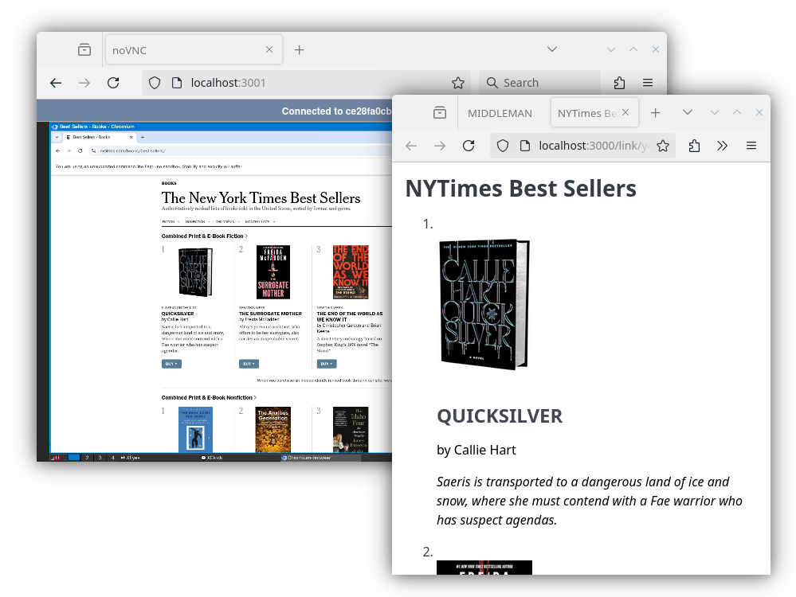

# MIDDLEMAN



Use [Docker](https://docker.com) or [Podman](https://podman.io) to pull the container image and run it:

```bash
docker run -p 3000:3000 -p 3001:3001 ghcr.io/mcp-getgather/middleman
```

Then open `localhost:3000` and pick one of the examples.

Open `localhost:3001` to view the containerized desktop live.

See also [DEVELOPMENT.md](DEVELOPMENT.md).
